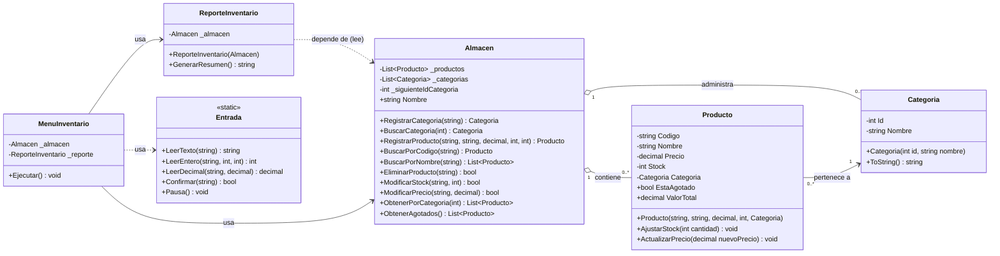

# Diagrama UML (Mermaid)

Pega este bloque en https://mermaid.live para exportarlo como imagen/PDF, o usa la extensión
de Mermaid en VS Code. GitHub también lo renderiza directamente.

> Nota: los miembros marcados con `-` en Producto/Categoria son campos privados expuestos como
> propiedades públicas con `private set` (o solo lectura). Si tu profesor pide visibilidad
> explícita de las propiedades, cámbialas a `+`.
